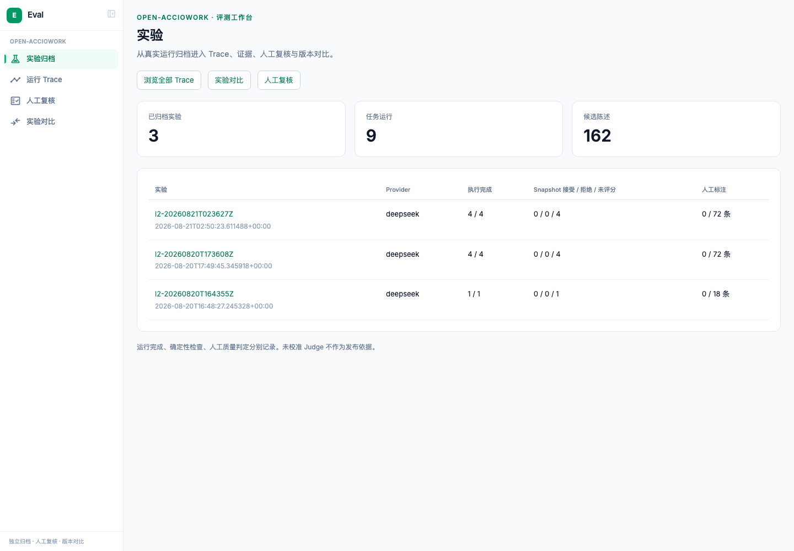

# Open-Acciowork 评测工作台

将 Open-Acciowork 的真实 L2 归档接入 Agent-eval-kit 的 `frontend/`，形成
**实验 → Trace → 证据与产物 → 人工复核 → 实验对比**的连续工作流。
默认入口是 `/acciowork/experiments`。使用已有 v1 导航、路由和页面组织方式，
用专用适配器解释原生事件及 Gold 语义；数据不会经过购物研究采集器或百分制评分器。

当前提供历史浏览、逐陈述标注、开放编码与版本对照。创建和执行新实验、Judge
运行与校准尚未接入这个适配器。没有模型调用，也不会据未知版本推断质量改善。

## 启动

从 Agent-eval-kit 根目录运行。相邻目录 `../Open-Acciowork` 只是以下示例的路径，
可换成显式选择的报告和运行日志目录；适配器不 import 被测产品。

```bash
# 可复用现有平台的 .venv。独立归档服务只需要 FastAPI、Uvicorn 和 Pydantic。
python3.11 -m venv .venv
.venv/bin/pip install 'fastapi>=0.115,<1' 'uvicorn>=0.34,<1' 'pydantic>=2.10,<3'

# 显式导入三组现有 L2 报告及其本地日志、Gold 候选档案。
PYTHONPATH=backend .venv/bin/python -m adapters.open_acciowork import \
  --report ../Open-Acciowork/evals/reports/l2-20260820T164355Z/overall.json \
  --report ../Open-Acciowork/evals/reports/l2-20260820T173608Z/overall.json \
  --report ../Open-Acciowork/evals/reports/l2-20260821T023627Z/overall.json \
  --runs-dir ../Open-Acciowork/backend/data/runs \
  --samples ../Open-Acciowork/evals/gold/samples/batch-20260821T025243Z.json

# 仅启动归档服务，固定绑定 127.0.0.1:8100。
PYTHONPATH=backend .venv/bin/python -m adapters.open_acciowork serve

# 另一个终端，使用已接通的 frontend/。
cd frontend
npm ci
npm run dev -- --host 127.0.0.1
```

打开 **http://127.0.0.1:5200/acciowork/experiments**。

完整平台 `backend/main.py` 也挂载了相同的 `/api/acciowork` API；已有平台运行时，
无需再启动独立服务。此 API 即使挂载在完整平台中仍要求 loopback 客户端与 Host。
原平台 API 和购物实验数据库不作格式迁移。

独立 SQLite 默认写入 `backend/open-acciowork.db`（Git 忽略）。CLI 的 `--db` 参数
放在子命令前；完整平台使用 `ACCIOWORK_EVAL_DB` 指定同一个绝对路径。
单独服务可用 `serve --port 8101`；前端用
`EVAL_API_TARGET=http://127.0.0.1:8101 npm run dev -- --port 5201` 连接。

## 归档与判定语义

- `overall.json` 对应一次归档实验，各任务记录保留 task、run_id、trace_id。
  内容与来源不变时重复导入幂等；来源内容变化时创建新归档，保留旧副本和复核记录。
- 逐文件保存原始字节、路径和 SHA-256，界面可下载评测库内的副本。CLI 只读显式
  选择的输入。拒绝 task/run 路径穿越；子目录符号链接不可越出选择的根目录。
- 优先读取任务 bundle 内的 `events.jsonl`；该文件不存在时才使用 `--runs-dir`。
  坏行、错 run、重复/缺失 sequence、空文件和报告事件数不符会单独列出。
  合法事件按 sequence 分页；保留原始事件、tool_use_id、输入输出、授权与错误。
- 缺失 `snapshot.json` 时，不把当前业务账本当成历史评分输入。已有 Gold 批次内的
  final_text、evidence、artifacts 可供查看，但来源明确标作“Gold 抽样档案”。
- 执行状态、旧报告 passed、Snapshot accepted 和逐陈述人工标注分开记录。
  缺失分数、时长、成本和版本保持 null；实际零值保留。SDK 标价成本以其估计口径展示。
- findings 保留 code/message/path；点击 path 可查看对应的冻结 Snapshot 字段。
- 对比按 case_key 分组，新增/移除 Case 独立显示，多次运行不会任取一条覆盖。
  任务输入、Fixture、评分器、Profile、schema 必须相同，且模型和 Skill 配置都有记录，
  才能把确定性判定变化标为改善/退化。配置变化仍会显示；缺失版本只能人工对照。

## 人工标注与开放编码

进入“人工复核”按 judge、未标注/已标注、train/dev/test、陈述文字筛选，点击陈述
进入对应 Trace 的标注位置。原始来源、条目 ID 和预分配 split 保持不变。

负责人本人勾选身份声明，选择判定并填写理由后保存。不会预选未知标签或生成模型标签。

| Judge | label=true | label=false |
|---|---|---|
| evidence-coverage | 已覆盖 | 未覆盖 |
| unsourced-claims | 有来源 / 合规 | 无来源 |
| fact-inference-confusion | **存在混淆** | 没有混淆 |

标签和开放编码使用独立记录，有修改历史和乐观版本检查；过时页面的保存返回 409，
要求刷新复核。开放编码和复核状态不会生成整条 Trace 的 human_pass，也不会写 Gold。

“人工复核”页可按 judge 导出原 Gold JSONL 字段，包含 item_id、run_id、item、label、
rationale、judge、source、split、batch、labeled_at。导出文件由负责人按现有校准
流程使用；工具不会自动覆盖 Open-Acciowork 的 `evals/gold/`。
已有人工标签也可显式导入，需先导入其候选批次：

```bash
PYTHONPATH=backend .venv/bin/python -m adapters.open_acciowork import-labels \
  --file /path/to/existing-human-labels.jsonl
```

标签身份和 split 必须匹配候选；相同记录幂等，冲突标签拒绝覆盖。

## API 契约

所有路径以 `/api/acciowork` 开头。GET 只读归档库，文件接口使用已导入的内容 hash，
没有 HTTP 读取任意本地路径或启动模型的接口。

| 路径 | 用途 |
|---|---|
| GET `/experiments` | 实验来源及执行/检查/人工标注计数 |
| GET `/traces?experiment_id=…` | 运行索引 |
| GET `/traces/{id}` | 结果、证据、产物、版本、来源和逐条标注 |
| GET `/traces/{id}/events` | offset/limit、kind、q、sequence 查询（limit ≤ 200） |
| GET `/review` | 候选条目及 Judge 问题、正负类语义 |
| PUT `/items/{item_id}/label` | label、rationale、revision、owner_confirmed |
| PUT `/traces/{id}/review` | status、open_codes、notes、revision |
| GET `/labels/{judge}/export` | 人工标签 JSONL |
| GET `/files/{sha256}` | 原始导入文件下载 |
| GET `/compare?left=…&right=…` | 逐 Case 的可比性与判定对照 |

写接口要求 `X-Eval-Review: owner-ui`，拒绝跨站请求、非布尔标签、缺失理由和过时版本。
这是本机负责人工具；不提供团队账号或远程部署认证。

## 验证

```bash
.venv/bin/pip install 'pytest>=8,<9' 'httpx>=0.28,<1' 'ruff>=0.9,<1'
PYTHONPATH=backend .venv/bin/python -m pytest backend/tests/test_open_acciowork.py -q
.venv/bin/ruff check --config backend/adapters/open_acciowork/ruff.toml \
  backend/adapters backend/tests/test_open_acciowork.py
cd frontend
npm run lint
npm run build
```

测试只使用临时合成数据，覆盖文件副本/幂等性、损坏与缺失日志、事件查询、路径隔离、
Gold 正反方向、标签导入导出、并发修改、开放编码、版本对照和本机 API 边界。

2026-09-09 验证：29 项离线测试、前端 lint/build 通过；真实归档浏览与临时合成数据的
标签/复核保存、刷新恢复通过隔离 Chromium 验收，无页面异常。真实 162 条候选保持未标注。



## 本轮要求清单

| 要求 | 状态 |
|---|---|
| 复用已接通的 v1 平台组织方式、增加领域适配器 | delivered：frontend 路由/导航，独立 archive adapter |
| 真实实验 → Trace → 证据与产物 | delivered：三组历史归档，9 次运行、133,342 个事件 |
| 逐陈述 Gold、开放编码、刷新恢复、原格式导出 | delivered：162 个候选条目；真实人工标签仍为 0 |
| Case 对比、增删项和版本缺失说明 | delivered：严格区分可比/未知，保留双侧 Trace |
| 新实验创建/批量执行、SSE、取消与授权 | deferred：本轮先接通既有真实数据和复核 |
| Judge 运行、校准与发布门禁 | deferred：需要负责人 Gold 与新运行适配器，未承诺校准结论 |
| 自动生成真实标签、改写产品账本、付费运行 | omitted：不属于本轮接入范围 |
